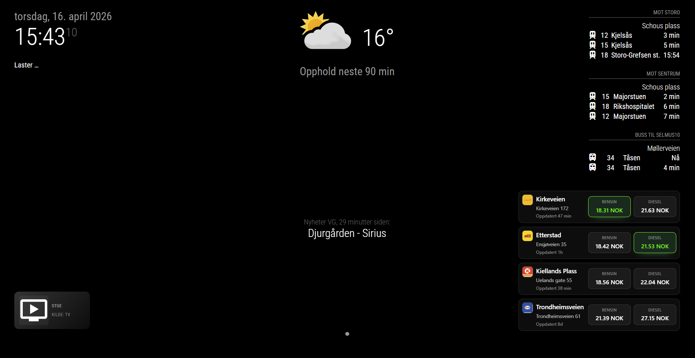

# MMM-FuelNorway

A [MagicMirror²](https://magicmirror.builders/) module that displays live Norwegian fuel prices using the [Drivstoff App](https://www.drivstoffapp.no/) API. Find nearby stations automatically or configure specific stations by ID — with support for petrol, diesel, HVO100, and electric fast-charging prices.


---

## Features

- 📍 **Nearby mode** – automatically fetch stations within a configurable radius of your location
- 🔖 **Manual mode** – pin specific station IDs you care about
- ⛽ **Multiple fuel types** – petrol, diesel, HVO100, electric (fast-charge)
- 🏆 **Cheapest price highlight** – visually flag the best price per fuel type
- 🗺️ **List and grid layouts** – vertical or horizontal orientation
- 📐 **Five size variants** – xxsmall, xsmall, small, medium, large
- 🖼️ **Brand logos** – shows the station's brand logo when available
- 🎨 **Figma redesign implemented** – frosted cards, tighter typography, and cleaner price chips
- 🏷️ **Resilient naming** – falls back to address/ID when station names are missing from the API
- 🌍 **Bilingual** – English and Norwegian (Bokmål/Nynorsk) translations
- ♻️ **Smart caching** – avoids redundant API calls between update intervals
- 🔄 **Auto-retry** – configurable retry logic on API failure

---

## Installation

```bash
cd ~/MagicMirror/modules
git clone https://github.com/matskkolstad/MMM-FuelNorway.git
cd MMM-FuelNorway
npm install
```

---

## Configuration

Add the module to your `config/config.js`:

### Minimal – nearby stations

```javascript
{
  module: 'MMM-FuelNorway',
  position: 'top_right',
  config: {
    method: 'nearby',
    latitude: 59.9139,   // your latitude
    longitude: 10.7522,   // your longitude
  },
},
```

### Full example

```javascript
{
  module: 'MMM-FuelNorway',
  position: 'top_right',
  header: 'Fuel Prices',
  config: {
    method: 'nearby',
    latitude: 59.9139,
    longitude: 10.7522,
    radius: 5,
    maxStations: 5,
    updateInterval: 15 * 60 * 1000,
    retryAttempts: 3,
    retryDelay: 5000,

    displayMode: 'list',        // 'list' or 'grid'
    orientation: 'vertical',   // 'vertical' or 'horizontal'
    moduleSize: 'medium',      // 'xxsmall', 'xsmall', 'small', 'medium', 'large'

    fuelTypes: ['gasoline_price', 'diesel_price'],
    // Available: 'gasoline_price', 'gasoline_95_price', 'gasoline_98_price',
    //            'diesel_price', 'hvo100_price', 'fd_price'

    showStationName: true,
    showAddress: true,
    addressFormat: 'street',   // 'street', 'city', 'full'
    showLastUpdated: true,
    lastUpdatedFormat: 'relative',  // 'relative' or 'absolute'
    showBrandLogo: true,

    highlightCheapest: true,
    priceHighlightColor: '#00ff00',

    currencyFormat: 'NOK',
    decimalPlaces: 2,
    compactPriceFormat: false,

    debug: false,
  },
},
```

**Notes**
- `latitude`, `longitude`, and `radius` accept either numbers or numeric strings (useful when values come from environment variables).
- In `manual` mode you can still provide `latitude`/`longitude`; when present, distances are calculated for those stations too.
- Configuration errors returned by the helper are now surfaced in the module UI to speed up troubleshooting.
- `displayMode: 'list'` renders stations as a vertical card list. Switch to `'grid'` for tiled cards.
- `moduleSize: 'xxsmall'` is the most compact layout for tighter tablet dashboards.
- `moduleSize: 'xsmall'` is optimized for smaller tablet screens where module footprint needs to be reduced further.
- `moduleSize: 'small'` tightens padding and price chips to reduce whitespace on dense dashboards.
- Stations are automatically sorted by the cheapest available price across your configured fuel types before applying `maxStations`, and cheapest highlights are calculated from the stations that are actually displayed.

### Layout tips

- Price chips keep their label and value on the same line; when space is tight they scroll horizontally instead of wrapping.
- Use `orientation: 'vertical'` to stack station details above the price chips and center-align card content.
- Use `orientation: 'horizontal'` to keep station details and prices side by side.
- `moduleSize: 'xxsmall'` applies the most aggressive spacing reduction for very limited screen space.
- `moduleSize: 'xsmall'` minimizes padding, spacing, and card internals for compact tablet layouts.
- `moduleSize: 'small'` trims padding and chip spacing for dashboards that need to fit many modules.

### Manual – specific stations

```javascript
{
  module: 'MMM-FuelNorway',
  position: 'top_right',
  config: {
    method: 'manual',
    stationIds: ['j1i4da8bf8wkcql', 'mw85fkdf8cq9b5n'],
    displayMode: 'grid',
    fuelTypes: ['gasoline_price', 'diesel_price', 'hvo100_price'],
  },
},
```

### All configuration options

See [`docs/CONFIGURATION.md`](docs/CONFIGURATION.md) for the complete reference table.

---

## Finding Station IDs

Station IDs are provided by the Drivstoff App API. You can find them by making a nearby request manually:

```
GET https://backend.drivstoffapp.no/stations/fuel/nearby?lat=59.9139&lng=10.7522&radius=5
```

Each station object in the response contains an `id` field — use that value in your `stationIds` array.

---

## API Integration Notes

- **Base URL:** `https://backend.drivstoffapp.no`
- **Nearby endpoint:** `GET /stations/fuel/nearby?lat={lat}&lng={lng}&radius={km}`
- **Single station:** `GET /stations/fuel/{station_id}`
- No authentication required for public endpoints
- Prices are returned nested under `station.prices.*`; the module normalises these automatically
- The module respects the `updateInterval` and will not make duplicate requests within that window (caching)
- Station distance is calculated using the Haversine formula (the API does not return a distance field)
- The API does not automatically retrieve data from fuel suppliers or stations. It relies on manually updated prices, and this is the data the API exposes.

### API response structure (summary)

```json
{
  "id": "j1i4da8bf8wkcql",
  "name": "Fredensborg",
  "logo": "https://...",
  "street": "Maridalsveien 10",
  "city": "Oslo",
  "zip": "0178",
  "location": { "latitude": 59.920, "longitude": 10.751 },
  "prices": {
    "gasoline_price": 19.20,
    "gasoline_95_price": 19.20,
    "gasoline_98_price": null,
    "diesel_price": 24.61,
    "hvo100_price": null,
    "fd_price": null,
    "last_updated": "2026-04-09T11:03:29Z"
  }
}
```

---

## Troubleshooting

| Symptom | Solution |
|---------|----------|
| "No stations found" | Check your `latitude`/`longitude` values and increase `radius` |
| "Error loading fuel prices" | Enable `debug: true` and check browser/server logs |
| Prices show `–` for every station | Verify `fuelTypes` contains valid keys — see the API notes section |
| Prices not updating | The module caches results; wait for `updateInterval` to expire |
| Module blank on startup | Verify `method`, `latitude`, and `longitude` are set correctly |
| Station names are blank | The helper now falls back to address/ID; ensure the API returns location data |
| HTTP 500 error | Error you may get if you are using method: 'nearby', switch to method: 'manual' (This is an error with the API, not the module) |

Enable debug logging with `debug: true` in the config. Logs appear in the MagicMirror server console prefixed with `[MMM-FuelNorway]`.

---

## Internationalization

The module ships with English (`en`) and Norwegian (`no` / `nb` / `nn`) translations. MagicMirror² will automatically pick the translation that matches your `language` setting in `config.js`.

To use Norwegian:
```javascript
// In config/config.js
language: 'no'
```

---

## License & Credits

MIT License — see [`LICENSE`](LICENSE) for details.

Copyright (c) 2026 Mats Kjoshagen Kolstad. Created with AI assistance.

Fuel price data provided by the [Drivstoff App](https://www.drivstoffapp.no/) API.

---

## Update

To update the module:

```bash
cd ~/MagicMirror/modules/MMM-FuelNorway
git switch main
git pull
npm install
```

---

## Contributing

Contributions are welcome! Please open an issue or pull request on GitHub.
By participating, you agree to follow the [Code of Conduct](CODE_OF_CONDUCT.md).

1. Fork the repository
2. Create your feature branch (`git switch -c feature/my-feature`)
3. Commit your changes following [Conventional Commits](https://www.conventionalcommits.org/)
4. Push to your branch and open a pull request
